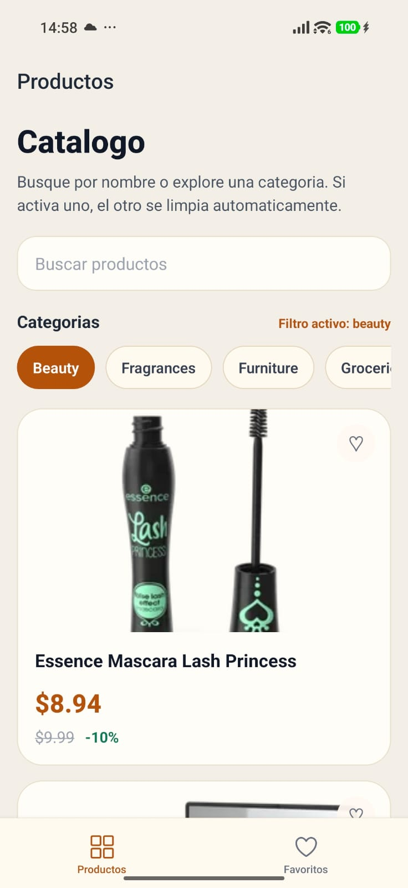
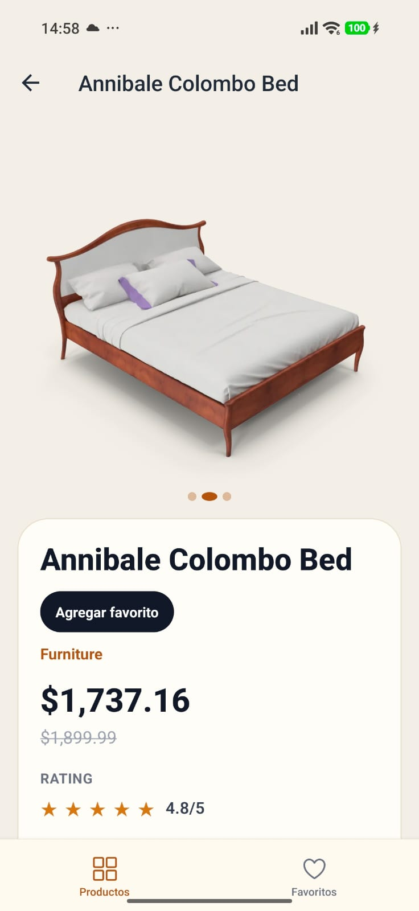
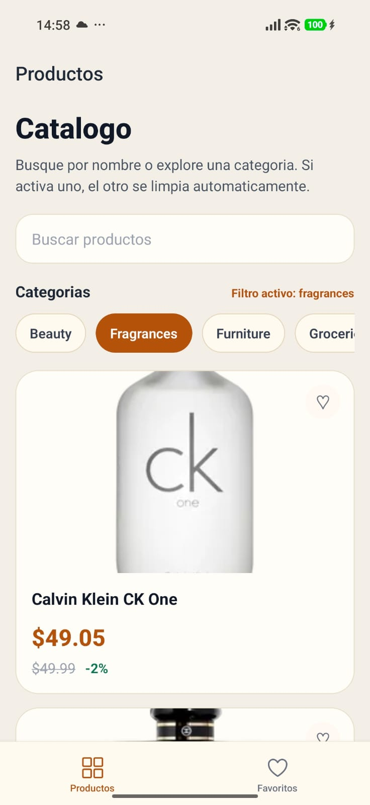
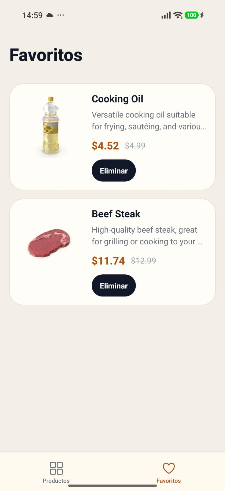

# Prueba Técnica Topaz

Aplicación mobile en React Native para consultar productos de DummyJSON, con búsqueda, filtros, detalle y gestión de favoritos persistidos localmente.

## Requisitos del entorno

Antes de ejecutar el proyecto, asegúrate de tener instalado lo siguiente:

- Node.js 20 LTS o superior
- React Native CLI
- Java JDK 17
- Android Studio + Android SDK
- Xcode 15+ y Command Line Tools para iOS
- Ruby 3.x
- CocoaPods

Recomendación oficial para esta versión de React Native 0.81: usar Node 20.19.4 o una versión compatible más reciente.

## Instalación

1. Clona el repositorio:

```bash
git clone <url-del-repositorio>
cd prueba-tecnica-topaz
```

2. Instala las dependencias de JavaScript:

```bash
npm install
```

3. Si vas a correr en iOS, instala los pods:

```bash
cd ios
bundle install
bundle exec pod install
cd ..
```

4. Si vas a correr en Android, asegúrate de tener un emulador o un dispositivo conectado y aceptado para depuración:

```bash
npx react-native doctor
```

## Cómo correr la app

### iOS

```bash
npm run ios
```

Si prefieres arrancar Metro manualmente antes:

```bash
npm start
npm run ios
```

### Android

```bash
npm run android
```

O si quieres iniciarlo con Metro separado:

```bash
npm start
npm run android
```

## Cómo correr los tests

Ejecuta la suite de Jest con:

```bash
npm test -- --watch=false
```

También puedes correr lint si lo necesitas:

```bash
npm run lint
```

## Arquitectura y decisiones técnicas

### 1. Estado y datos remotos: React Query + Zustand

Se utilizó React Query para manejar la capa de datos remotos y Zustand para el estado local de la aplicación.

- React Query se encarga de cache, reintentos, refetch, estado de carga/error y sincronización simple de llamadas a la API.
- Zustand se usa para el estado reactivo y persistido de favoritos, evitando mezclar lógica de networking con estado global de UI.
- Esta separación deja clara la responsabilidad de cada pieza: remotas vs locales.

### 2. Persistencia local: MMKV

Los favoritos se guardan en `react-native-mmkv` por su velocidad y por su integración natural con React Native.

- Es sincronía y muy eficiente para datos pequeños y de uso frecuente.
- Permite volver a la pantalla de favoritos sin necesidad de consultar el backend.
- Se integra correctamente con Zustand mediante persistencia custom.

### 3. Cliente HTTP centralizado: Axios

La capa HTTP está encapsulada en un cliente único para evitar duplicación y errores en cada request.

- Se centraliza la base URL y configuración global.
- Se manejan errores HTTP y de red de manera consistente.
- Se facilita el uso de timeouts y cancelación de requests.

### 4. Cache de imágenes: react-native-fast-image

Se usó `@d11/react-native-fast-image` para mejorar la experiencia visual en listas largas.

- Cache nativo de imágenes remotas.
- Mejor rendimiento que el `Image` base en listas con varios productos.
- Mayor estabilidad al renderizar contenido visual con muchas imágenes.

### 5. Navegación

Se implementó una estructura basada en tabs y stack:

- Tab principal para Productos y Favoritos.
- Stack anidado para detalle de producto.
- Tipado fuerte de rutas para reducir errores de navegación y mejorar mantenibilidad.

### 6. Manejo de errores

Se incorporó un `Error Boundary` global con estados de carga, vacíos y reintentos para que la app sea más robusta frente a fallas en red o respuestas inesperadas.

## Funcionalidades principales

- Listado de productos con paginación infinita.
- Búsqueda con debounce.
- Filtro por categoría.
- Vista de detalle del producto.
- Toggle de favoritos con persistencia local.
- Pantalla de favoritos.
- Estados de carga, error, vacío y reintento.
- Navegación entre pantallas con tabs y stack.

## Endpoints utilizados

- `GET /products`
- `GET /products/{id}`
- `GET /products/search?q=`
- `GET /products/categories`
- `GET /products/category/{cat}`

## Capturas de pantalla / GIF

### Screenshots

<p align="center">
  
  
</p>

<p align="center">
  
  
</p>

### GIF

<p align="center">
  
</p>

## Nota de entorno

La app está construida con React Native 0.81. En este proyecto se recomienda usar Node 20 y versiones recientes de Java, Ruby y CocoaPods para evitar problemas de toolchain y compilación.

## Licencia

Este proyecto se entrega como ejercicio técnico y puede adaptarse según el criterio del equipo que lo evalúa.
